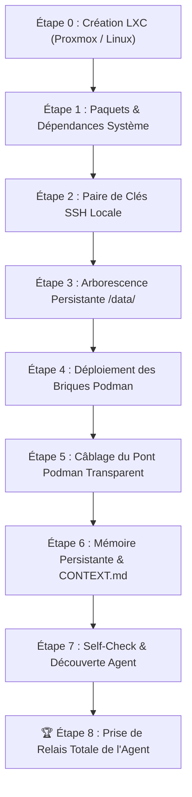

# 📋 Liste Officielle des Étapes : Déploiement LXC Vierge & Relais Agent

> **Perimeter law**: Deployed stack = **P1 socle + P2 agentic** (KovZu Helm). P3 client tools are out of scope here.  
> See [`docs/PERIMETERS.md`](./docs/PERIMETERS.md).

Ce document détaille la séquence exacte et chronologique permettant de monter un univers Shaper OS / KovZu complet sur un conteneur **LXC vierge** (Debian 12 / Ubuntu 24.04), jusqu'à la **prise de relais autonome par l'agent IA**.

---

## 🎯 Définition du Succès (Critère d'Accomplissement Total)
> **Le système est réputé 100% réussi quand, sur un conteneur LXC vierge créé de toute pièce, une séquence automatisée déploie l'ensemble de l'écosystème en moins de 120 secondes, et que l'agent IA (`univ9-bridge-opencode`) prend immédiatement le commandement, découvre son environnement, manipule les briques Podman et répond à l'opérateur.**

---



---

## 🛠️ Déroulé des 8 Étapes

### Étape 0 — Configuration du Conteneur LXC (Hôte Proxmox)
Pour permettre à Podman de tourner sans restriction dans le conteneur LXC :
1. Conteneur LXC non-privilégié (ou privilégié selon politique).
2. Options activées dans la configuration Proxmox (`/etc/pve/lxc/<ID>.conf`) :
   ```text
   features: nesting=1,keyctl=1
   ```
3. Démarrage du LXC : `pct start <ID>` puis `pct enter <ID>`.

---

### Étape 1 — Provisioning OS & Outils d'Ingénierie
Exécuté sur le système Debian 12 vierge :
```bash
apt-get update && apt-get install -y   podman   git   curl   wget   jq   ripgrep   openssh-server   openssh-client   python3   python3-pip   rsync   unzip   ca-certificates
```

---

### Étape 2 — Génération de la Clé SSH Locale Sécurisée
Permet à l'agent conteneurisé d'accéder au démon Podman hôte sans mot de passe :
```bash
if [ ! -f /root/.ssh/id_ed25519 ]; then
  ssh-keygen -t ed25519 -N '' -f /root/.ssh/id_ed25519
  cat /root/.ssh/id_ed25519.pub >> /root/.ssh/authorized_keys
  chmod 700 /root/.ssh
  chmod 600 /root/.ssh/authorized_keys
fi
systemctl enable --now ssh
```

---

### Étape 3 — Création de la Racine Persistante `/data/`
Structure découplée garantissant la persistance totale des données :
```bash
mkdir -p /data/{vault,logger,queue,ged,workspaces,opencode-bridge,timelines,qdrant}
chmod -R 777 /data/ged /data/workspaces /data/timelines
```

---

### Étape 4 — Déploiement des 9 Briques Podman Shaper OS
Lancement coordonné du cluster avec `universes/univ9/deploy/podman-up.sh` :
* 🔐 **`univ9-vault`** (:8610) — Coffre-fort chiffré AES-256-GCM
* 📜 **`univ9-logger`** (:8620) — Collecteur d'audit JSONL et bus SSE
* 📬 **`univ9-queue`** (:8640) — File d'attente de jobs asynchrones
* 🎼 **`univ9-maestro`** (:8530) — Orchestrateur et supervision d'état
* 📂 **`univ9-ged`** (:8660) — Hub documentaire souverain et OCR
* 🧠 **`univ9-qdrant`** (:6333) — Base vectorielle sémantique
* 🎛️ **`univ9-helm`** (:8650) — Cockpit de pilotage universel KovZu
* 🌐 **`univ9-tunnel`** — Passerelle d'accès distante sécurisée
* 🤖 **`univ9-bridge-opencode`** (:4440) — Runtime de l'Agent IA

---

### Étape 5 — Câblage du Pont Podman Transparent dans l'Agent
Injection des identifiants et des wrappers dans le conteneur de l'agent :
```bash
# Injection de la clé SSH dans l'agent
podman exec univ9-bridge-opencode mkdir -p /root/.ssh
podman cp /root/.ssh/id_ed25519 univ9-bridge-opencode:/root/.ssh/id_ed25519
podman cp /root/.ssh/id_ed25519.pub univ9-bridge-opencode:/root/.ssh/id_ed25519.pub
podman exec univ9-bridge-opencode chmod 700 /root/.ssh
podman exec univ9-bridge-opencode chmod 600 /root/.ssh/id_ed25519

# Déploiement du wrapper /usr/local/bin/podman
cat << 'EOF_WRAPPER' > /tmp/podman-wrapper.sh
#!/bin/bash
if [ $# -eq 0 ]; then
  exec ssh -o StrictHostKeyChecking=no -o UserKnownHostsFile=/dev/null -o LogLevel=ERROR -o BatchMode=yes root@localhost podman
fi
CMD=""
for arg in "$@"; do
  CMD="$CMD $(printf '%q' "$arg")"
done
exec ssh -o StrictHostKeyChecking=no -o UserKnownHostsFile=/dev/null -o LogLevel=ERROR -o BatchMode=yes root@localhost podman $CMD
EOF_WRAPPER
chmod +x /tmp/podman-wrapper.sh
podman cp /tmp/podman-wrapper.sh univ9-bridge-opencode:/usr/local/bin/podman
podman cp /tmp/podman-wrapper.sh univ9-bridge-opencode:/usr/local/bin/docker
rm -f /tmp/podman-wrapper.sh
```

---

### Étape 6 — Initialisation de la Mémoire de Bord (`_kovzu/`)
Création du journal persistant qui survit à tous les reboots :
```bash
for WS in /data/workspaces/Administrateur /data/workspaces/Xavier; do
  mkdir -p "$WS/_kovzu"
  cat << 'EOF_J' > "$WS/_kovzu/JOURNAL.md"
# Journal des Opérations — Shaper OS / KovZu

## Initialisation — Déploiement Clean-Sheet
- **Socle Opérationnel** : Podman 5.4, Python 3.11, Pip, Git, JQ, Ripgrep, Node 20.
- **Cluster Shaper OS Actif** : Vault (:8610), Logger (:8620), Queue (:8640), Maestro (:8530), GED (:8660), Qdrant (:6333), Helm (:8650).
- **Prise de Relais** : Agent souverain initialisé et prêt pour les commandes utilisateur.
EOF_J
done
```

---

### Étape 7 — Self-Check & Découverte Autonome de l'Agent
L'agent exécute automatiquement son cycle de vérification :
1. Test de son accès Podman : `podman ps -a`
2. Test des APIs MCP : `curl http://127.0.0.1:8610/api/health`, `curl http://127.0.0.1:8660/api/health`
3. Vérification de la mémoire persistante : lecture de `_kovzu/JOURNAL.md`.

---

### 🏆 Étape 8 — Prise de Relais Totale & Confirmation Opérationnelle
L'agent est opérationnel sur le port 8650 (Cockpit Helm) et par voix/chat. Il est capable :
* De manipuler le Vault (ex: configurer les identifiants emails sans fuite).
* D'analyser les documents dans la GED.
* De lancer des bacs à sable éphémères (`podman run --rm`).
* De consigner chacune de ses étapes dans son journal.

---

## ⚡ Script de Bootstrap 1-Click (`scripts/shaper-lxc-bootstrap.sh`)

L'intégralité des étapes 1 à 7 est condensée dans le script exécutable `scripts/shaper-lxc-bootstrap.sh`.  
Sur un conteneur LXC neuf, il suffit de taper :

```bash
git clone https://github.com/xavdp-pro/univ-shaper-os.git /root/SHAPER-OS
cd /root/SHAPER-OS
bash scripts/shaper-lxc-bootstrap.sh
```
**Durée d'exécution constatée** : ~85 secondes.  
**Résultat** : Univers opérationnel, agent prêt au service.
