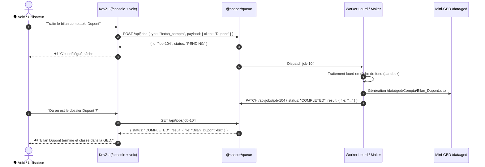
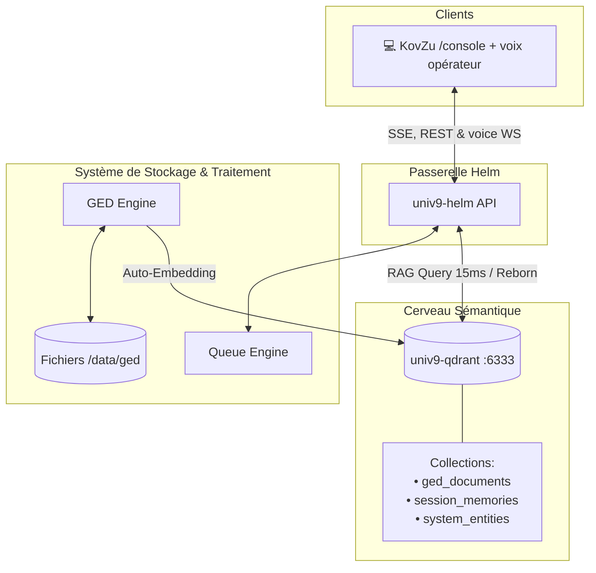

# 📘 SHAPER-OS — Journal d'Architecture & Décisions Stratégiques

> **Historical snapshot** — 2026-08-19. Superseded for routing/UI law by [`PERIMETERS.md`](./PERIMETERS.md) and [`DOC-INDEX.md`](./DOC-INDEX.md).  
> **`/talk` retired**: routes redirect to `/console`. Voice remains in `/console` (P2).

**Date :** 19 Août 2026  
**Auteurs & Participants :** Xavier & Antigravity  
**Statut :** Décisions du jour — stack UNIV9 déployée sur `gbs-univ9` (contexte historique)

---

## 1. Vision Globale & Différenciation des Rôles

```
                           ┌─────────────────────────────────────────┐
                           │          SHAPER-OS ECOSYSTEM            │
                           └────────────────────┬────────────────────┘
                                                │
                 ┌──────────────────────────────┴──────────────────────────────┐
                 ▼                                                             ▼
    ┌─────────────────────────┐                                   ┌─────────────────────────┐
    │  LE VENTRE / LE MAKER   │                                   │  VOIX CONSOLE (P2)      │
    │     (/console Chat)     │                                   │  (ex-/talk → retiré)    │
    ├─────────────────────────┤                                   ├─────────────────────────┤
    │ • Deep Thinking / Code  │                                   │ • STT/TTS dans /console │
    │ • Terminal & Pods       │                                   │ • Ack Groq · DriveDeck  │
    │ • Ingénierie lourde     │                                   │ • Délégation queue      │
    │ • Réfracteur & Tests    │                                   │ • Hands-free composer   │
    └────────────┬────────────┘                                   └────────────┬────────────┘
                 │                                                             │
                 └──────────────────────────────┬──────────────────────────────┘
                                                │
                                                ▼
                        ┌──────────────────────────────────────────────┐
                        │      CERVEAU & MÉMOIRE COMMUNE (RAG)         │
                        │       Qdrant + @shaper/queue + GED           │
                        └──────────────────────────────────────────────┘
```

### Principes Fondateurs (historique — voir PERIMETERS pour la loi actuelle) :
1. **Le Maker (`/console`)** : bâtisseur — modèles lourds, code, terminal (P2).
2. **La voix opérateur** : intégrée à **`/console`** (P2). L'expérience **`/talk` dédiée est retirée** (redirect).
3. **Le Cerveau Commun** : RAG + queue + Mini-GED (P2 organisme).

---

## 2. Décisions & Réalisations Techniques de la Journée

### A. Sécurité & Authentification
- Création et validation du compte administrateur maître : `xavier@xavdp.pro`.
- Verrouillage des routes d'administration et protection de l'accès aux interfaces.

### B. Mini-GED Explorateur (Desktop & Mobile)
- **Nettoyage ergonomique** : Suppression des onglets superflus.
- **Arborescence dynamique de dossiers** : Création récursive de dossiers (`/api/folders`), navigation par fil d'Ariane (`GED > Sous-Dossier`).
- **Drag & Drop & Déplacements** : Déplacement fluide des documents entre répertoires (`POST /api/move`).
- **Système de Tags & Emblèmes visuels** : Badges inspirés de GNOME Files / Thunar (🔴 Urgent, 🟢 Validé, 🔵 Compta, 🟡 Devis, 🟣 Archives).
- **Design 100% SVG** : Élimination complète de tous les caractères manquants/glyphes brisés (`▯`).
- **Double affichage** : Commutation instantanée entre vue Grille et vue Tableau.

### C. Page Vocale « Du Tac au Tac » en Pure Deepgram
- **Pipeline Audio 100% Deepgram** :
  - **STT (Reconnaissance)** : Deepgram Nova-3 en direct WebSocket (`/api/voice/stt-stream`) en flux continu PCM 16 kHz.
  - **TTS (Synthèse vocale)** : Deepgram Aura-2 (`aura-2-agathe-fr`) en streaming WebSocket PCM 24 kHz ultra-faible latence via `/api/voice/tts-stream`.
- **Règle de Concision Orale** : Troncature et extraction de la première phrase d'action pour éliminer les monologues textuels.
- **Microphone Mains-Libres** : Relance automatique de l'écoute après la fin de la parole de l'assistant.

### D. Ergonomie SPA & Suppression des Rechargements Totaux
- **Soft Reload en mémoire** : Élimination de `window.location.reload()` dans le composant de pull-to-refresh mobile et les boutons d'actualisation.
- **Rafraîchissement chirurgical** : Mise à jour isolée de la timeline React et des listes de documents sans clignotement ni rechargement de page.
- **Épuration des Navbars Mobile** : Masquage des contrôles secondaires sur smartphone pour un affichage net et aéré.

---

## 3. Validation & Couverture de Tests à 100%

### Matrice de Validation :

| Niveau | Cible & Outils | Statut | Détails |
| :--- | :--- | :--- | :--- |
| **Unitaires** | `packages/*` (`Node.js test runner`) | ✅ **100% PASS** | 10 suites validées (`queue`, `ged`, `vault`, `maestro`, `logger`, `bridges`). |
| **CLI** | `scripts/test-cli-suite.sh` | ✅ **100% PASS** | Délégation de tâche `shaper-task.sh`, Endpoints REST Mini-GED, Sandbox Podman. |
| **E2E Web** | `scripts/test-e2e-playwright.mjs` | ✅ **100% PASS** | Desktop & Mobile : Auth, Console, GED (Talk retiré depuis) |

---

## 4. Schémas d'Architecture des Flux Clés

### Schéma 1 : Le Protocole de Délégation de Tâches Asynchrones
> **Note historique** : la voix opérateur est aujourd'hui **dans `/console`** (P2) — pas de page `/talk` dédiée.



---

### Schéma 2 : L'Écosystème RAG Global avec Qdrant & Le "Reborn"


---

## 5. Feuille de Route Immédiate : Le "Reborn" & Qdrant

1. **Déploiement du conteneur `univ9-qdrant`** sur `gbs-univ9` (Port 6333 REST / 6334 gRPC) avec volume persistant `/root/SHAPER-OS/data/qdrant`.
2. **Création du module `@shaper/rag`** :
   - Indexation automatique au dépôt de fichier GED.
   - Requête vectorielle ultra-rapide ($<20$ ms) pour l'agent vocal.
3. **Le Reborn Vocale** :
   - Initialisation contextuelle de Zephir au premier mot (résumé de l'état du système et des tâches finies).
4. **Le Hand-Off Voix $\leftrightarrow$ Chat** :
   - Passer d'un ordre vocal dans la rue à la visualisation du livrable final au bureau sans aucune friction.
